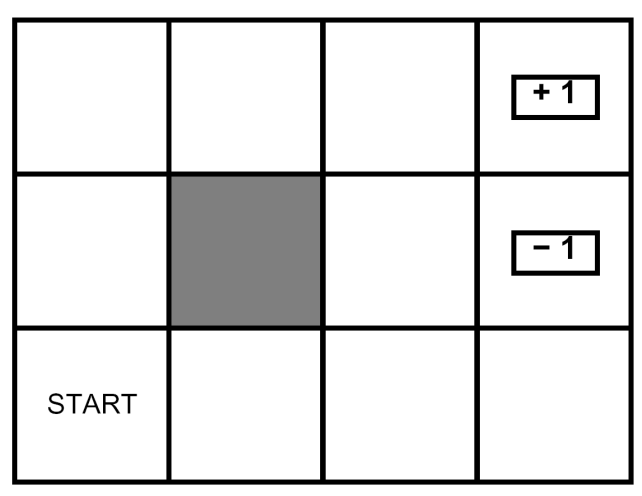

# MDP: Bonus
This is an extra work for 1-point bonus.
This can be used for preparing the real [MDP Lab](../mdp).

# The problem: Classic 3x4 gridworld

A point robot operates on a gridworld, say a 3-by-4 gridworld as shown above.
The state of a point robot can be fully represented by the coordinate of the grid where it is in.
A point robot has no bearing (direction where it is facing to).

The white grids indicate free grids.
The gray grids, if any, indicate unavailable grids interpreted as obstacles.
There is one goal grid (on the top right corner in the figure above).
There is also a hole grid (ie. the grid below the goal grid in the figure above).
The robot has to navigate from an initial start grid to the goal grid repeatedly
because once it has reach the goal or the hole, it is teleported back to the start.
This resembles episode repetitions.

Every state has four available actions: 1-grid movement in North, East, South and West directions.
Specifically in the goal and hole grids, all actions lead to teleportation to the start grid according to the initial state distribution.
If an action brings the agent beyond the free white grids (eg outside the world or the obstacle),
then the agent stays at the current grid.
In other words, the robot will bounce back if it hits the wall, which is the boundary between free and unavailable grids.

The state-transition stochasticity is governed by an action-slip parameter. 
That is, the agent actually moves according to the chosen (intended) action only with a probability say `q < 1`. 
Otherwise, it moves in one of the other three directions due to slipping, each is with probability `(1 − q)/3`. 
There is no slipping during teleportation.

There is a reward of `+1` for transitioning to the goal grid.
There is a reward of `-1` for transitioning to the hole grid.
Teleportation does not incur any cost.
Any other movement costs `-0.01` to represent energy and time consumption.

# Tasks
Write code to find all optimal stationary deterministic policies on the gridworld presented above by exhaustive policy search.
Such optimality is based on two criteria: the discounted and average rewards.

The problem should be modeled using 10 states, including 1 terminal state that represent both goal and hole grids.
There are therefore, `4^10 = 1,048,576` SD policies.
