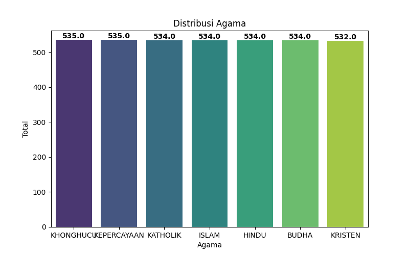
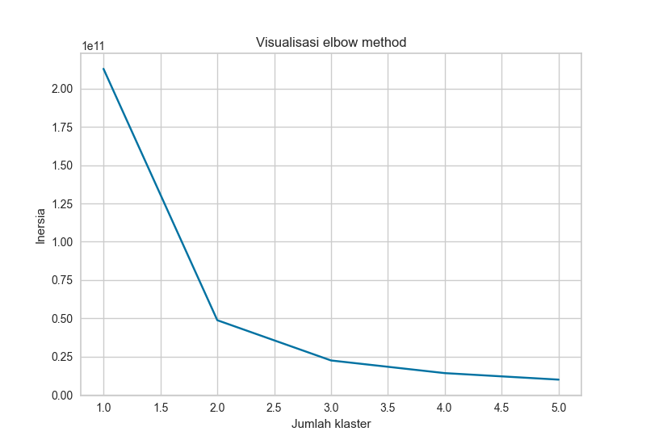
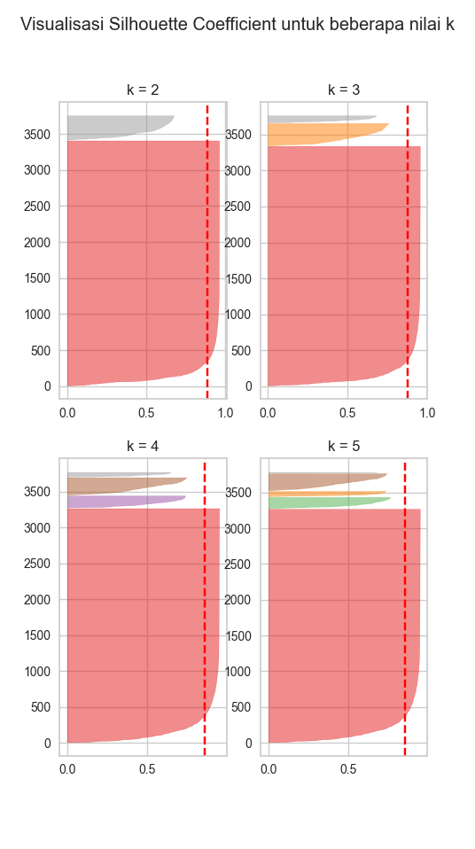
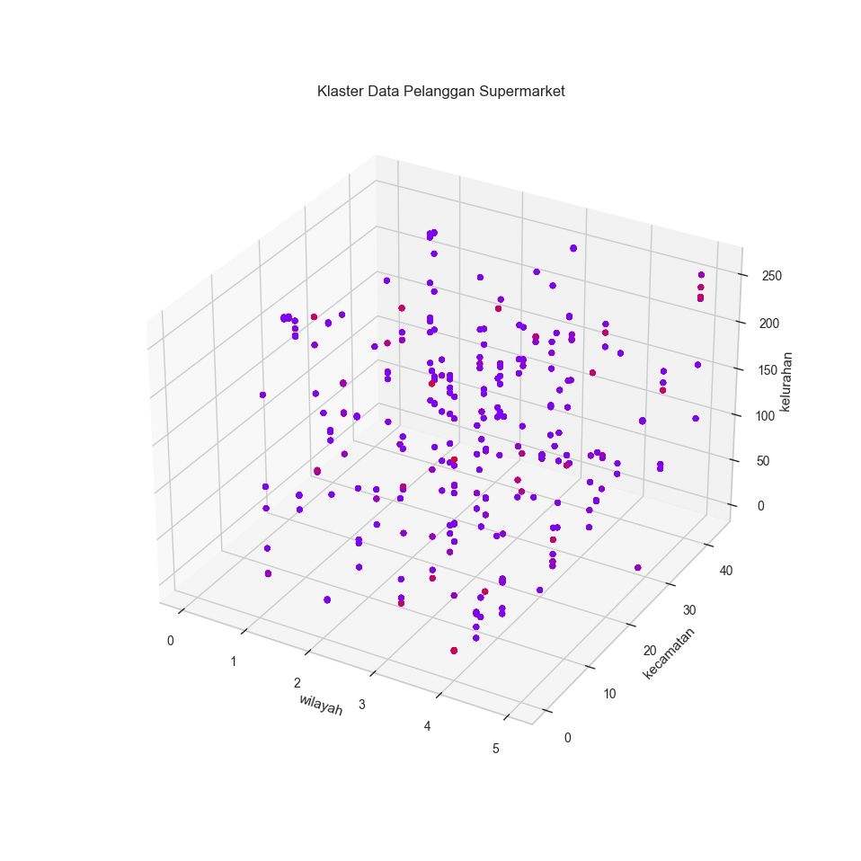

# Lab SLUL
| Author | NPM |
| -------- | ------- |
| Sandria Rania Isanura | 2206025363 |

# Klasifikasi Agama Penduduk DKI Jakarta
Eksperimen mengklasifikasi agama di DKI Jakarta.

# Objective
Dataset ini berisi data mengenai data jumlah orang penduduk di DKI Jakarta berdasarkan agama. Saya memilih dataset ini karena saya tertarik dengan distribusi agama-agama dari penduduk di wilayah seluruh Indonesia. 

Dengan dataset ini, saya berharap saya dapat mengklasifikasi agama berdasarkan variabel-variabel yang tersedia di dataset, yaitu periode_data, wilayah, kecamatan, kelurahan, jenis_kelamin, dan jumlah, menggunakan empat metode, yaitu Random Forest, XGBooster, GaussianNB, dan SVM. Menurut saya, topik ini cukup langka, sehingga tidak ada referensi sebelumnya, terutama dengan limitasi wilayah yang sangat spesifik yaitu DKI Jakarta. Beberapa referensi yang saya telah saya temukan adalah topik yang mencoba menklasifikasi agama berdasarkan [bendera](https://www.linkedin.com/pulse/religion-prediction-based-flags-using-data-mining-sowmya-sree/) atau [nama](https://github.com/appeler/pranaam).

Harapan saya, hasil dari eksperimen ini dapat memberikan manfaat seperti membantu memudahkan pembaca untuk melihat prediksi agama yang mendominasi wilayah atau area tertentu, baik untuk menambah wawasan dan ilmu atau sebagai referensi dalam eksperimen yang lebih mendalam.

# Exploratory Data Analysis
Dataset ini terdiri atas 3738 data poin dan 7 kelas, yaitu periode_data dengan 1 variabel unik, wilayah dengan 6 variabel unik, kecamatan dengan 44 variabel unik, kelurahan dengan 260 variabel unik, jenis_kelamin dengan 2 variabel unik, agama dengan 7 variabel unik, jumlah dengan 1596 variabel unik.

Dikarenakan saya ingin mengklasifikasi agama dari dataset ini, maka saya anggap agama adalah target variabel. Selanjutnya, berdasarkan grafik terdiri atas total data poin antar variabel agama sebagai berikut:



Dikarenakan jumlah antar agama relatif sama, maka saya anggap dataset ini balanced. Selain itu, dataset ini tidak memiliki data yang hilang, dan walaupun terdapat beberapa outlier, jumlahnya tidak signifikan terhadap keseluruhan dataset, maka tidak perlu diubah maupun dihapus.

# Methods
Untuk Unsupervised Learning, saya akan menggunakan PCA dan Agglomerative Clustering. Sebelum melakukan hal tersebut, saya melakukan beberapa preprocessing data.

Dikarenakan periode_data adalah variabel yang konstan, maka saya memilih menghapus variabel tersebut. Selain itu, berdasarkan data sebelumnya yang menunjukkan bahwa terdapat fitur kategorikal dengan puluhan hingga ratusan variabel unik, maka saya memilih untuk menggunakan label encoder.

Selanjutnya saya melakukan PCA, dan berdasarkan data explained_variance tersebut, maka saya memilih untuk tidak melakukan reduksi dimensi:
 ```sh
[23.5011822001892, 20.146925024041494, 19.999592273600005, 18.59790231631807, 17.75439818585123]
  ```

Berikut adalah hasil pembobotan variabel pada PCA dengan tiga komponen:
 ```sh
Feature names contributing to Component 1:
jumlah: 0.9999999884702306
kecamatan: -0.0001487195392212426
kelurahan: 2.807290914047869e-05
wilayah: 1.24076009930622e-05
jenis_kelamin: -2.0959726033733414e-08

Feature names contributing to Component 2:
kelurahan: 0.9999293143917327
kecamatan: 0.011882609797180607
wilayah: -0.0004112327673789117
jumlah: -2.6298646441665074e-05
jenis_kelamin: -6.919363607319096e-07

Feature names contributing to Component 3:
kecamatan: 0.9998949254684183
kelurahan: -0.011885609165378981
wilayah: -0.008296035494794381
jenis_kelamin: -0.00015449741626289736
jumlah: 0.00014914050859082817
  ```

Selanjutnya untuk menentukan jumlah cluster terbaik untuk clustering, saya mencoba mencari Elbow Method dan Silhouette Coeffient sebagai berikut:

Elbow Method


Silhouette Coefficient


Selain itu, terlihat print silhouette coefficient sebagai berikut:
 ```sh
Print silhouette coefficient:
Untuk k = 2, rata-rata silhouette_coefficient adalah: 0.8863565770636033
Untuk k = 3, rata-rata silhouette_coefficient adalah: 0.8785373239901237
Untuk k = 4, rata-rata silhouette_coefficient adalah: 0.8570686664840022
Untuk k = 5, rata-rata silhouette_coefficient adalah: 0.8566800908450726
  ```
Maka, jumlah kluster terbaik adalah 2. Saya akan memvisualisasikan clustering dengan tiga variabel yang saya anggap memiliki pembobotan terbesar berdasarkan PCA sebelumnya, yaitu wilayah, kelurahan, dan kecamatan:

Agglomerative Clustering:


Dapat dilihat bahwa satu cluster sangat mendominasi cluster lainnya. Selain itu, cluster ini terlihat cukup tersebar merata di antara ketiga sumbu x, y, dan z, menunjukkan bahwa ketiga variabel ini memiliki pengaruh yang kurang lebih sama.

Selanjutnya untuk Supervisd Learning, terrdapat tiga metode yang saya akan gunakan dan bandingkan, yaitu RandomForestClassifier, SVC, dan XGBClassifier. Sebelum melakukan pemodelan, saya melakukan hyperparameter tuning pada parameter berikut:

RandomForestClassifier: n_estimators, max_depth, dan class_weight. \
SVC: C dan kernel. \
XGBClassifier: n_estimators=n_estimators, max_depth, subsample. 

Setelah itu, saya melakukan train_test_split sebanyak 100 kali. Metrik penilaian yang saya gunakan adalah f1_macro, dikarenakan menurut saya precision dan recall sama-sama penting dalam konteks klasifikasi ini, serta menurut saya dataset cukup balanced sehingga macro lebih menguntungkan.


Catatan: Sayangnya, ketika perbandingan model terjadi error sehingga hanya muncul rata-rata f1 macro dan micro dari XGBClassifier dan SVM, maka karena keterbatasan waktu, saya hanya akan membandingkan dua model tersebut:

 ```sh
Rata-rata f1 macro dari XGBooster Classifier: 0.6542
Rata-rata f1 micro dari XGBooster Classifier: 0.6553
Rata-rata f1 macro dari SVM: 0.4547
Rata-rata f1 micro dari SVM: 0.4727
 ```

# Comparison Analysis

Dari hasil tersebut dapat dilihat bahwa hasil prediksi dari XGBClassifier lebih besar dari SVM, menunjukkan bahwa dalam kasus ini, maka dalam kasus ini, berdasarkan preprocessing dan tuning yang telah dilakukan, XGBClassifier merupakan model yang lebih baik daripada SVM. Hal ini mungkin dikarenakan XGB adalah metode ensemble sehingga menghasilkan data yang jauh lebih akurat dibanding SVM, yang menggunakan algoritma linear. Untuk ke depannya saya harap saya dapat melakukan tuning dan pemilihan metode yang lebih cocok agar mencapai hasil yang jauh lebih baik dari sekarang.

# A reference section is not necessary
Only few references are expected. They should be specified within the sections above as needed.

# Appendix is not necessary
Do not put any appendix. 
